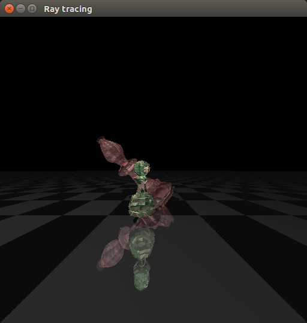
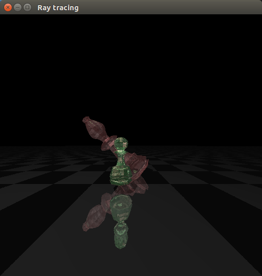
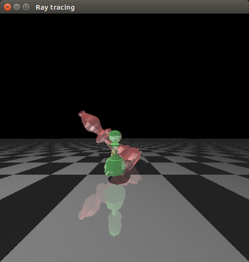

### Glass-Chess
This is a bonus part of homework assignment of CMPT361/SFU

#### Technique Implemented
- SMF reader
- parallel ray tracing via multiple thread
- bounding volume hierarchy with AABB(Axis-Aligned minimum bounding box)

#### Build Guide
```bash
make
./raycast step_max <options>
```
- step_max: max depth of ray tracing
- options:
    + +p: turn on parallel ray tracing
    + +b: turn on bounding volume hierarchy


#### Result & ScreenShot

```bash
bowenc@bowenc-MS-7A59:~/cmpt361/glass-chess$ ./raycast 6 +b +p
Num of intersection: 3924721
Ray Trace done in 0.151097 s
```
<div>

</div>

```bash
bowenc@bowenc-MS-7A59:~/cmpt361/glass-chess$ ./raycast 6 +p
Num of intersection: 641162400
Ray Trace done in 5.058907 s
```
<div>

</div>

```bash
bowenc@bowenc-MS-7A59:~/cmpt361/glass-chess$ ./raycast 1 +b
Num of intersection: 676182
Ray Trace done in 0.133134 s
```
<div>

</div>

To see the efficiency of bounding volume and parallel tracing


| trace depth | bbh | parallel | Intersection | Time(s) |
| ----------- | --- | -------- | ------------ | ---- |
| 1 | on | off | 676182 | 0.165687s |
| 1 | off | on | 432298400 | 3.131259s |
| 1 | off | off | 432298400 | 11.594307s |
| 1 | on | on | 676182 | 0.047875s |
| 4 | on | off | 2788389 | 0.338186s |
| 4 | off | on | 546695200 | 4.124525s |
| 4 | off | off | 546695200 | 14.655227 |
| 4 | on | on | 2788389 | 0.118568s |


#### Implementation Detail
##### OOP
It turns out that the origin skeleton code is messed up with global and extern variable. It would be more elegant if we reorganized everything into class and treat tracer, triangle, plane and others as object.
##### Parallel Ray Tracing
The main idea of it is to assign different region of image for each tracer, and let tracers do ray tracing in thread independently, where each tracer only casts ray through pixels inside its assigned region. The idea to wrap tracer suff into a class is really beneficial here.
##### Bounding Volume Hierachy with AABB
The basic idead of BVH is to split the space recursively and wrap the objects into a bounding box. When it comes to intersection, we can intersect with bounding box first and then triangles inside.

The general procedure are:
- Bvh Tree construction
    + start with root node, which contains all the objects
        + wrap all the vertexes of object into a bbox(bounding box), set it as the box of node
        + wrap all the centroid of object into another bbox
            + find the axis with largest length
            + divide the bbox into two part, and split the objects inside accordingly
        + then have left node and right node
        + do the same thing on left node and right node recursively
    + when finished, we have a tree, which each node has a list of objects which wrapped by a bbox
- Bvh Intersection
    + given eye, ray
    + travere the tree, do the intersection on nodes
        + if intersects, do the intersection on its children
        + if intersect leaves, do the intersection on the objects wrapped inside

#### Reference
[Box intersection](https://www.scratchapixel.com/lessons/3d-basic-rendering/minimal-ray-tracer-rendering-simple-shapes/ray-box-intersection)
[Bounding Volume Hierarchy](http://fileadmin.cs.lth.se/cs/Education/EDAN30/lectures/S2-bvh.pdf)

#### Tricks

##### ptr allocatation inside function
For ptr of C++, in the following case
```c++
void A(){
    int * p;
    init(p)
}
void init(int * p){
    p = new int[100];
}
```
The p in A() will not have access to the newed array. As ptr p is copied to init(), so its value(adress of space it points to) will not change.
The righy way is to use reference of ptr.
```c++
void A(){
    int * p;
    init(p)
}
void init(int * &p){
    p = new int[100];
}
```

##### glm
When deal with glm, it's better to declare value ends in *.*f, otherwise there could be error like
```bash
note: ‘glm::vec3 {aka glm::tvec3<float, (glm::precision)0u>}’ is not derived from ‘const glm::tmat4x4<T, P>’
```
(relevant reference on stackoverflow)[https://stackoverflow.com/questions/12085109/cant-get-glmrotate-to-work]

